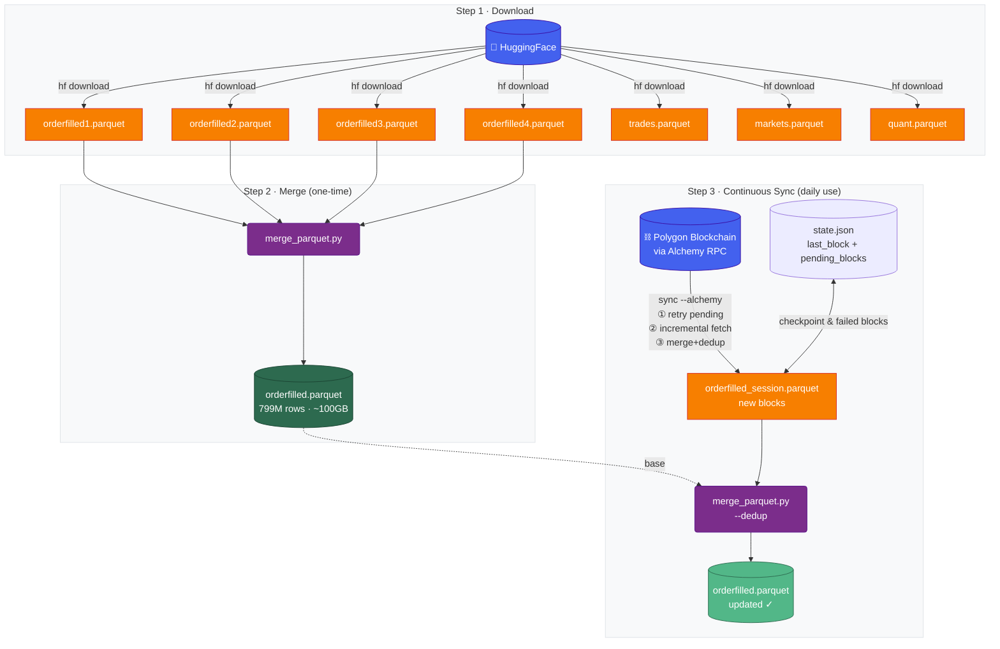

<div align="center">

<h1>Polymarket Data</h1>

<h3>Complete Data Infrastructure for Polymarket — Download, Merge, Stay Updated</h3>

<p style="max-width: 600px; margin: 0 auto;">
A comprehensive toolkit and dataset for Polymarket prediction markets. Download historical data from HuggingFace, merge into a single file, and keep it up-to-date with incremental blockchain fetching.
</p>

<p>
<b>Zhengjie Wang</b><sup>1,2</sup>, <b>Leiyu Chao</b><sup>1,3</sup>, <b>Yu Bao</b><sup>1,4</sup>, <b>Lian Cheng</b><sup>1,3</sup>, <b>Jianhan Liao</b><sup>1,5</sup>, <b>Yikang Li</b><sup>1,†</sup>
</p>

<p>
<sup>1</sup>Shanghai Innovation Institute &nbsp;&nbsp; <sup>2</sup>Westlake University &nbsp;&nbsp; <sup>3</sup>Shanghai Jiao Tong University
<br>
<sup>4</sup>Harbin Institute of Technology &nbsp;&nbsp; <sup>5</sup>Fudan University
</p>

<p>
<sup>†</sup>Corresponding author
</p>

</div>

<p align="center">
  <a href="https://huggingface.co/datasets/SII-WANGZJ/Polymarket_data">
    
  </a>
  <a href="https://github.com/SII-WANGZJ/Polymarket_data">
    
  </a>
  <a href="https://github.com/SII-WANGZJ/Polymarket_data/blob/main/LICENSE">
    
  </a>
  <a href="https://www.python.org/downloads/">
    
  </a>
</p>

---

## TL;DR

**163GB of on-chain trading data** from Polymarket — 800M+ raw events, 470M+ processed trades across 600K+ markets, from inception to present. Download the historical snapshot from HuggingFace, merge into a single file, then use this toolkit to keep it current with incremental blockchain fetching.

## Dataset Overview

| File | Size | Records | Description |
|------|------|---------|-------------|
| `orderfilled.parquet` | ~100GB | 799.3M | Raw blockchain OrderFilled events (split into 4 shards on HuggingFace) |
| `trades.parquet` | 28GB | 470.8M | Processed trades with market metadata linkage |
| `markets.parquet` | 85MB | 607K | Market information and metadata |
| `quant.parquet` | 30GB | 470.8M | Clean trades with unified YES perspective |
| `users.parquet` | — | — | User-level split by maker/taker (generated locally, not on HuggingFace) |

**Coverage**: 2022-11-21 to present

## Workflow



---

## Quick Start

### 1. Install

```bash
git clone https://github.com/SII-WANGZJ/Polymarket_data.git
cd Polymarket_data
uv sync
```

### 2. Configure

```bash
cp .env.example .env
```

Edit `.env` with your Alchemy API key (free tier at [alchemy.com](https://www.alchemy.com/) — 30M CU/month, sufficient for all use cases):

```bash
ALCHEMY_API_KEY=your_alchemy_api_key_here
```

### 3. Download Historical Data

```bash
# Install HuggingFace CLI
uv tool install huggingface-hub

# Download all files (~163GB)
hf download SII-WANGZJ/Polymarket_data --repo-type dataset --local-dir data/dataset

# Or download specific files
hf download SII-WANGZJ/Polymarket_data trades.parquet --repo-type dataset --local-dir data/dataset
hf download SII-WANGZJ/Polymarket_data quant.parquet --repo-type dataset --local-dir data/dataset
hf download SII-WANGZJ/Polymarket_data markets.parquet --repo-type dataset --local-dir data/dataset
```

### 4. Merge orderfilled Shards (one-time)

HuggingFace distributes `orderfilled` as 4 shards. Merge them into a single file (streaming, memory-safe):

```bash
uv run python -m polymarket.tools.merge_parquet data/dataset/orderfilled1.parquet data/dataset/orderfilled2.parquet data/dataset/orderfilled3.parquet data/dataset/orderfilled4.parquet -o data/dataset/orderfilled.parquet --log-file logs/merge.log -y
```

Monitor progress:

```bash
# Linux / macOS / Git Bash
tail -f logs/merge.log

# Windows PowerShell
Get-Content logs/merge.log -Wait
```

### 5. Continuous Sync (daily use)

One command to do everything: **retry failed blocks → incremental fetch → merge with dedup**

```bash
uv run polymarket sync --alchemy
```

`sync` runs three steps automatically:

1. **Retry pending_blocks**: reads failed block ranges from `state.json`, retries with adaptive batching (10→5→1 blocks/batch, exponential backoff)
2. **Incremental fetch**: fetches from `last_block` (stored in `state.json`) to chain head
3. **Merge + dedup**: merges all session files into `orderfilled.parquet`, deduplicates overlapping rows

`state.json` is the single source of truth:
- `fetch_onchain.last_block`: last successfully processed block
- `pending_blocks`: failed block ranges across sync runs, with cumulative attempt counts

Also update market metadata:

```bash
uv run polymarket fetch-markets        # fetch new markets
uv run polymarket update-markets       # refresh unclosed market states
```

---

## Data Schema

### orderfilled.parquet — Raw Blockchain Events

| Field | Type | Description |
|-------|------|-------------|
| `timestamp` | uint64 | Unix timestamp |
| `block_number` | uint64 | Block number |
| `transaction_hash` | str | Transaction hash |
| `log_index` | uint32 | Log index within transaction |
| `contract` | str | `CTF_EXCHANGE` or `NEGRISK_CTF_EXCHANGE` |
| `order_hash` | str | Order hash |
| `maker` / `taker` | str | Trading party addresses |
| `maker_asset_id` / `taker_asset_id` | str | Asset IDs |
| `maker_amount_filled` / `taker_amount_filled` | bytes[32] | Filled amounts (raw 256-bit little-endian) |
| `maker_fee` / `taker_fee` / `protocol_fee` | bytes[32] | Fees (raw 256-bit little-endian) |

### trades.parquet — Processed Trades

| Field | Type | Description |
|-------|------|-------------|
| `timestamp` | uint64 | Unix timestamp |
| `block_number` | uint64 | Block number |
| `transaction_hash` | str | Transaction hash |
| `log_index` | uint32 | Log index within transaction |
| `contract` | str | `CTF_EXCHANGE` or `NEGRISK_CTF_EXCHANGE` |
| `market_id` | str | Market identifier (linked from token) |
| `condition_id` | str | Condition identifier |
| `event_id` | str | Event identifier |
| `maker` / `taker` | str | Wallet addresses |
| `price` | float | Trade price (0–1) |
| `usd_amount` | float | USDC value |
| `token_amount` | float | Token amount |
| `maker_direction` / `taker_direction` | str | `BUY` or `SELL` |
| `nonusdc_side` | str | `token1` (YES) or `token2` (NO) |
| `asset_id` | str | Non-USDC asset ID |

### quant.parquet — Unified YES Perspective

Filtered and normalized: contract trades removed, all trades normalized to YES token (token1).

**Best for**: market analysis, price studies, time-series forecasting.

| Field | Type | Description |
|-------|------|-------------|
| `timestamp` | uint64 | Unix timestamp |
| `block_number` | uint64 | Block number |
| `transaction_hash` | str | Transaction hash |
| `log_index` | uint32 | Log index within transaction |
| `market_id` | str | Market identifier |
| `condition_id` | str | Condition identifier |
| `event_id` | str | Event identifier |
| `price` | float | Trade price (0–1) |
| `usd_amount` | float | USD value |
| `token_amount` | float | Token amount |
| `side` | str | `token1` (YES) or `token2` (NO) |
| `maker` / `taker` | str | Wallet addresses |

### markets.parquet — Market Metadata

| Field | Type | Description |
|-------|------|-------------|
| `id` | str | Market identifier |
| `question` | str | Market question text |
| `slug` | str | URL slug |
| `condition_id` | str | Condition identifier |
| `token1` / `token2` | str | YES / NO token IDs |
| `answer1` / `answer2` | str | Option names |
| `closed` / `active` / `archived` | uint8 | Market state flags |
| `outcome_prices` | str | Final outcome prices (JSON) |
| `volume` | float | Total trading volume |
| `event_id` | str | Parent event identifier |
| `event_slug` | str | Parent event URL slug |
| `event_title` | str | Parent event title |
| `created_at` | timestamp | Market creation time |
| `end_date` | timestamp | Market resolution date |
| `updated_at` | timestamp | Last update time |
| `neg_risk` | uint8 | Whether neg-risk market |

### users.parquet — User Behavior (generated locally)

Each trade split into 2 records (maker + taker), all converted to BUY direction (negative amount = sell).

**Best for**: user profiling, PnL calculation, wallet analysis.

Generate with:

```bash
uv run polymarket clean
```

---

## CLI Reference

```bash
# ★ Daily maintenance: full sync in one command (recommended)
uv run polymarket sync --alchemy

# Fetch new market metadata
uv run polymarket fetch-markets

# Refresh states of unclosed markets
uv run polymarket update-markets

# Fetch new on-chain blocks manually (from last checkpoint)
uv run polymarket fetch-onchain --continue --alchemy

# Fetch specific block range
uv run polymarket fetch-onchain --range 80000000 80100000 --alchemy

# Process orderfilled → trades
uv run polymarket process

# Generate quant.parquet and users.parquet from trades
uv run polymarket clean
```

## Utility Tools

```bash
# Merge multiple parquet files (streaming, memory-safe)
uv run python -m polymarket.tools.merge_parquet file1.parquet file2.parquet -o merged.parquet

# Merge with dedup (for session files from incremental fetches)
uv run python -m polymarket.tools.merge_parquet file1.parquet file2.parquet -o merged.parquet --dedup

# Sort parquet by timestamp
uv run python -m polymarket.tools.sort_parquet input.parquet -o sorted.parquet

# Manually refetch failed blocks (normally handled automatically by sync)
uv run python -m polymarket.tools.refetch_failed_blocks data/failed_blocks_<timestamp>.txt --alchemy
```

## Project Structure

```
Polymarket_data/
├── polymarket/              # Core Python package
│   ├── cli/                 # Command-line interface
│   ├── fetchers/            # Data fetchers (RPC, Gamma API)
│   ├── processors/          # Data processors (decoder, cleaner)
│   └── tools/               # Utility tools (merge, sort, etc.)
├── scripts/                 # Shell scripts
├── data/                    # Data storage (gitignored)
│   ├── dataset/             # Main parquet files
│   ├── data_clean/          # Derived files (quant, users)
│   └── latest_result/       # CSV previews
├── logs/                    # Logs (gitignored)
├── .env                     # Local config (gitignored)
├── .env.example             # Config template
├── pyproject.toml
└── uv.lock
```

## Data Quality

- **Complete History**: All OrderFilled events from Polymarket's two exchange contracts, no missing blocks
- **Blockchain Verified**: Cross-checked against Polygon RPC nodes
- **Two Contracts Tracked**:
  - `0x4bFb41d5B3570DeFd03C39a9A4D8dE6Bd8B8982E` (CTF_EXCHANGE)
  - `0xC5d563A36AE78145C45a50134d48A1215220f80a` (NEGRISK_CTF_EXCHANGE)

## Contributing

1. **Report Issues**: [Open an issue](https://github.com/SII-WANGZJ/Polymarket_data/issues)
2. **Contribute Code**: Improve our pipeline via pull requests

## License

MIT License — free for commercial and research use. See [LICENSE](LICENSE).

## Contact

**Maintainer (this fork)**
- **GitHub**: [tsaiyber](https://github.com/tsaiyber)
- **Email**: [tsaiyber00001@gmail.com](mailto:tsaiyber00001@gmail.com)

**Original Authors**
- **Email**: [wangzhengjie@sii.edu.cn](mailto:wangzhengjie@sii.edu.cn)
- **Issues**: [GitHub Issues](https://github.com/SII-WANGZJ/Polymarket_data/issues)
- **Dataset**: [HuggingFace](https://huggingface.co/datasets/SII-WANGZJ/Polymarket_data)

## Citation

```bibtex
@misc{polymarket_data_2026,
  title={Polymarket Data: Complete Data Infrastructure for Polymarket},
  author={Wang, Zhengjie and Chao, Leiyu and Bao, Yu and Cheng, Lian and Liao, Jianhan and Li, Yikang},
  year={2026},
  howpublished={\url{https://huggingface.co/datasets/SII-WANGZJ/Polymarket_data}},
  note={A comprehensive dataset and toolkit for Polymarket prediction markets}
}
```

---

<div align="center">

[HuggingFace](https://huggingface.co/datasets/SII-WANGZJ/Polymarket_data) • [GitHub](https://github.com/SII-WANGZJ/Polymarket_data) • [Documentation](polymarket_data/DATA_DESCRIPTION.md)

</div>
