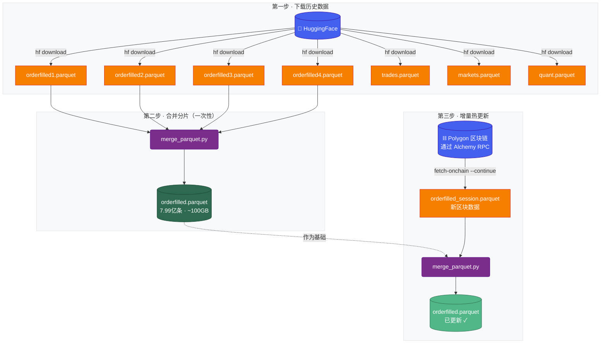

<div align="center">

<h1>Polymarket 数据集</h1>

<h3>个人数据基础设施 — 下载、合并、持续更新</h3>

<p style="max-width: 600px; margin: 0 auto;">
基于 <a href="https://github.com/SII-WANGZJ/Polymarket_data">SII-WANGZJ/Polymarket_data</a> fork 的个人维护版本。从 HuggingFace 下载历史数据，合并为单文件，并通过增量链上抓取持续保持最新。
</p>

<p>
维护者：<b><a href="https://github.com/tsaiyber">tsaiyber</a></b>
</p>

<p style="font-size: 0.9em; color: #666;">
感谢原始作者：王正杰、晁磊宇、鲍宇、程炼、廖建瀚、李一康（上海创新研究院等）
</p>

</div>

<p align="center">
  <a href="https://huggingface.co/datasets/SII-WANGZJ/Polymarket_data">
    
  </a>
  <a href="https://github.com/tsaiyber/Polymarket_data">
    
  </a>
  <a href="https://github.com/SII-WANGZJ/Polymarket_data/blob/main/LICENSE">
    
  </a>
  <a href="https://www.python.org/downloads/">
    
  </a>
</p>

---

## 简介

**163GB 链上交易数据**，涵盖 Polymarket 从上线至今的全部记录：8 亿条原始事件、4.7 亿条处理后交易、60 万个市场。从 HuggingFace 下载历史快照，合并为单文件，再用本工具包增量抓取最新数据，始终保持同步。

## 数据集概览

| 文件 | 大小 | 记录数 | 说明 |
|------|------|--------|------|
| `orderfilled.parquet` | ~100GB | 799.3M | 原始链上 OrderFilled 事件（HuggingFace 上分为 4 个分片） |
| `trades.parquet` | 28GB | 470.8M | 关联市场元数据后的处理交易 |
| `markets.parquet` | 85MB | 607K | 市场信息与元数据 |
| `quant.parquet` | 30GB | 470.8M | 统一 YES 视角的清洗交易 |
| `users.parquet` | — | — | 按 maker/taker 拆分的用户级数据（本地生成，HuggingFace 未上传） |

**时间覆盖**：2022-11-21 至今

## 工作流程



---

## 快速开始

### 1. 安装

```bash
git clone https://github.com/SII-WANGZJ/Polymarket_data.git
cd Polymarket_data
uv sync
```

### 2. 配置

```bash
cp .env.example .env
```

在 `.env` 中填入 Alchemy API Key（在 [alchemy.com](https://www.alchemy.com/) 免费注册，免费档 3000 万 CU/月，完全够用）：

```bash
ALCHEMY_API_KEY=你的_alchemy_api_key
```

### 3. 下载历史数据

```bash
# 安装 HuggingFace CLI
uv tool install huggingface-hub

# 下载全部文件（约 163GB）
hf download SII-WANGZJ/Polymarket_data --repo-type dataset --local-dir data/dataset

# 或按需下载单个文件
hf download SII-WANGZJ/Polymarket_data trades.parquet --repo-type dataset --local-dir data/dataset
hf download SII-WANGZJ/Polymarket_data quant.parquet --repo-type dataset --local-dir data/dataset
hf download SII-WANGZJ/Polymarket_data markets.parquet --repo-type dataset --local-dir data/dataset
```

### 4. 合并 orderfilled 分片（一次性）

HuggingFace 上的 `orderfilled` 分为 4 个分片，合并为单文件（流式处理，不会撑爆内存）：

```bash
uv run python -m polymarket.tools.merge_parquet \
  data/dataset/orderfilled1.parquet \
  data/dataset/orderfilled2.parquet \
  data/dataset/orderfilled3.parquet \
  data/dataset/orderfilled4.parquet \
  -o data/dataset/orderfilled.parquet \
  --log-file logs/merge.log -y
```

在后台运行，查看进度：

```bash
tail -f logs/merge.log
```

### 5. 增量热更新

从区块链抓取新区块，追加到本地数据：

```bash
# 从上次断点继续抓取新区块
uv run polymarket fetch-onchain --continue --alchemy
```

执行后会生成 `data/dataset/orderfilled_session_<时间戳>.parquet`，将其合并进主文件：

```bash
uv run python -m polymarket.tools.merge_parquet \
  data/dataset/orderfilled.parquet \
  data/dataset/orderfilled_session_*.parquet \
  -o data/dataset/orderfilled_new.parquet -y

# 替换主文件
mv data/dataset/orderfilled_new.parquet data/dataset/orderfilled.parquet
```

同步更新市场元数据：

```bash
uv run polymarket fetch-markets       # 获取新上线的市场
uv run polymarket update-markets      # 刷新未结算市场的状态
```

---

## 数据字段说明

### orderfilled.parquet — 原始链上事件

| 字段 | 类型 | 说明 |
|------|------|------|
| `timestamp` | uint64 | Unix 时间戳 |
| `block_number` | uint64 | 区块号 |
| `transaction_hash` | str | 交易哈希 |
| `log_index` | uint32 | 交易内日志索引 |
| `contract` | str | `CTF_EXCHANGE` 或 `NEGRISK_CTF_EXCHANGE` |
| `order_hash` | str | 订单哈希 |
| `maker` / `taker` | str | 交易双方地址 |
| `maker_asset_id` / `taker_asset_id` | str | 资产 ID |
| `maker_amount_filled` / `taker_amount_filled` | bytes[32] | 成交数量（链上原始 256 位小端序字节） |
| `maker_fee` / `taker_fee` / `protocol_fee` | bytes[32] | 手续费（链上原始 256 位小端序字节） |

### trades.parquet — 处理后交易

| 字段 | 类型 | 说明 |
|------|------|------|
| `timestamp` | uint64 | Unix 时间戳 |
| `block_number` | uint64 | 区块号 |
| `transaction_hash` | str | 交易哈希 |
| `log_index` | uint32 | 交易内日志索引 |
| `contract` | str | `CTF_EXCHANGE` 或 `NEGRISK_CTF_EXCHANGE` |
| `market_id` | str | 市场 ID（由 token 自动关联） |
| `condition_id` | str | Condition ID |
| `event_id` | str | Event ID |
| `maker` / `taker` | str | 钱包地址 |
| `price` | float | 成交价格（0–1） |
| `usd_amount` | float | USDC 金额 |
| `token_amount` | float | Token 数量 |
| `maker_direction` / `taker_direction` | str | `BUY` 或 `SELL` |
| `nonusdc_side` | str | `token1`（YES）或 `token2`（NO） |
| `asset_id` | str | 非 USDC 资产 ID |

### quant.parquet — 统一 YES 视角

过滤合约地址交易，所有交易统一换算为 YES token（token1）视角。

**适用于**：市场分析、价格研究、时间序列预测。

| 字段 | 类型 | 说明 |
|------|------|------|
| `timestamp` | uint64 | Unix 时间戳 |
| `block_number` | uint64 | 区块号 |
| `transaction_hash` | str | 交易哈希 |
| `log_index` | uint32 | 交易内日志索引 |
| `market_id` | str | 市场 ID |
| `condition_id` | str | Condition ID |
| `event_id` | str | Event ID |
| `price` | float | 成交价格（0–1） |
| `usd_amount` | float | USDC 金额 |
| `token_amount` | float | Token 数量 |
| `side` | str | `token1`（YES）或 `token2`（NO） |
| `maker` / `taker` | str | 钱包地址 |

### markets.parquet — 市场元数据

| 字段 | 类型 | 说明 |
|------|------|------|
| `id` | str | 市场 ID |
| `question` | str | 市场问题文本 |
| `slug` | str | URL slug |
| `condition_id` | str | Condition ID |
| `token1` / `token2` | str | YES / NO Token ID |
| `answer1` / `answer2` | str | 选项名称 |
| `closed` / `active` / `archived` | uint8 | 市场状态标志 |
| `outcome_prices` | str | 最终结算价格（JSON） |
| `volume` | float | 总交易量 |
| `event_id` | str | 所属事件 ID |
| `event_slug` | str | 所属事件 URL slug |
| `event_title` | str | 所属事件标题 |
| `created_at` | timestamp | 市场创建时间 |
| `end_date` | timestamp | 市场结算日期 |
| `updated_at` | timestamp | 最后更新时间 |
| `neg_risk` | uint8 | 是否为 neg-risk 市场 |

### users.parquet — 用户行为数据（本地生成）

每笔交易拆分为 2 条记录（maker + taker），全部转换为 BUY 方向（负数金额 = 卖出）。

**适用于**：用户画像、盈亏计算、钱包分析。

生成命令：

```bash
uv run polymarket clean
```

---

## 命令速查

```bash
# 获取新上线市场元数据
uv run polymarket fetch-markets

# 刷新未结算市场状态
uv run polymarket update-markets

# 从断点继续抓取新区块
uv run polymarket fetch-onchain --continue --alchemy

# 抓取指定区块范围
uv run polymarket fetch-onchain --range 80000000 80100000 --alchemy

# 处理 orderfilled → trades
uv run polymarket process

# 生成 quant.parquet 和 users.parquet
uv run polymarket clean
```

## 工具命令

```bash
# 合并多个 parquet 文件（流式，不占内存）
uv run python -m polymarket.tools.merge_parquet file1.parquet file2.parquet -o merged.parquet

# 按时间戳排序
uv run python -m polymarket.tools.sort_parquet input.parquet -o sorted.parquet

# 补抓失败区块
uv run python -m polymarket.tools.refetch_failed_blocks --start 80000000 --end 80100000
```

## 项目结构

```
Polymarket_data/
├── polymarket/              # 核心 Python 包
│   ├── cli/                 # 命令行接口
│   ├── fetchers/            # 数据获取（RPC、Gamma API）
│   ├── processors/          # 数据处理（解码、清洗）
│   └── tools/               # 工具（合并、排序等）
├── scripts/                 # Shell 脚本
├── data/                    # 数据存储（git 忽略）
│   ├── dataset/             # 主 parquet 文件
│   ├── data_clean/          # 衍生文件（quant、users）
│   └── latest_result/       # CSV 预览
├── logs/                    # 日志（git 忽略）
├── .env                     # 本地配置（git 忽略）
├── .env.example             # 配置模板
├── pyproject.toml
└── uv.lock
```

## 数据质量

- **完整历史**：覆盖 Polymarket 两个交易所合约的全部 OrderFilled 事件，无缺失区块
- **链上验证**：数据经 Polygon RPC 节点交叉验证
- **监听合约**：
  - `0x4bFb41d5B3570DeFd03C39a9A4D8dE6Bd8B8982E`（CTF_EXCHANGE）
  - `0xC5d563A36AE78145C45a50134d48A1215220f80a`（NEGRISK_CTF_EXCHANGE）

## 贡献

1. **报告问题**：[提交 Issue](https://github.com/SII-WANGZJ/Polymarket_data/issues)
2. **贡献代码**：通过 Pull Request 改进数据管道

## 许可证

MIT 许可证，可免费用于商业和研究用途。详见 [LICENSE](LICENSE)。

## 联系方式

**维护者（本 fork）**
- **GitHub**：[tsaiyber](https://github.com/tsaiyber)
- **邮箱**：[tsaiyber00001@gmail.com](mailto:tsaiyber00001@gmail.com)

**原始作者**
- **邮箱**：[wangzhengjie@sii.edu.cn](mailto:wangzhengjie@sii.edu.cn)
- **问题反馈**：[GitHub Issues](https://github.com/SII-WANGZJ/Polymarket_data/issues)
- **数据集**：[HuggingFace](https://huggingface.co/datasets/SII-WANGZJ/Polymarket_data)

## 引用

如果本数据集或工具包对您的研究有帮助，请引用：

```bibtex
@misc{polymarket_data_2026,
  title={Polymarket Data: Complete Data Infrastructure for Polymarket},
  author={Wang, Zhengjie and Chao, Leiyu and Bao, Yu and Cheng, Lian and Liao, Jianhan and Li, Yikang},
  year={2026},
  howpublished={\url{https://huggingface.co/datasets/SII-WANGZJ/Polymarket_data}},
  note={A comprehensive dataset and toolkit for Polymarket prediction markets}
}
```

---

<div align="center">

[HuggingFace](https://huggingface.co/datasets/SII-WANGZJ/Polymarket_data) • [GitHub](https://github.com/SII-WANGZJ/Polymarket_data) • [English](README.md)

</div>
